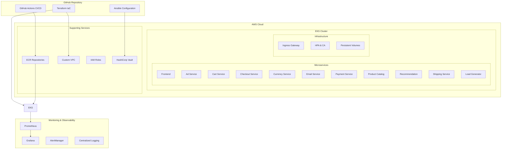

# Online Boutique - DevOps Microservices Project 

A comprehensive DevOps implementation of Google's Online Boutique microservices demo application, showcasing modern cloud-native practices with complete CI/CD automation, infrastructure as code, and enterprise-grade monitoring solutions.

## Project Overview

This project demonstrates the complete DevOps lifecycle implementation for the **Online Boutique** - a cloud-native microservices demo application. Through three comprehensive phases, we've transformed a basic application into a production-ready, scalable, and monitored system deployed on AWS EKS with full automation.

**Business Goal:** Implement a complete DevOps methodology for a complex microservices application, ensuring scalability, reliability, and operational excellence through automation and best practices.

## Architecture Diagram



## Technology Stack

| Category | Technologies |
|----------|-------------|
| **Infrastructure** |    |
| **Configuration Management** |   |
| **Containerization** |   |
| **CI/CD** |   |
| **Monitoring** |   |
| **Languages** |      |

## Repository Structure

```
├── terraform/              # Infrastructure as Code (IaC)
│   ├── main.tf               # Core AWS infrastructure definition
│   ├── variables.tf          # Configurable parameters
│   ├── vault-server.tf       # HashiCorp Vault infrastructure
│   └── iam-node-role.tf      # EKS node permissions
│
├── ansible/               # Configuration Management
│   ├── vault-playbook.yml    # Vault installation & configuration
│   ├── inventory             # Target server definitions
│   └── templates/            # Configuration templates
│
├── .github/workflows/     # CI/CD Automation
│   ├── ci.yml               # Continuous Integration pipeline
│   ├── cd.yml               # Continuous Deployment pipeline
│   └── security-scan.yml    # Security scanning automation
│
├── src/                   # Microservices Source Code
│   ├── frontend/            # React.js user interface
│   ├── cartservice/         # Shopping cart management (C#)
│   ├── productcatalogservice/ # Product inventory (Go)
│   ├── currencyservice/     # Currency conversion (Node.js)
│   ├── paymentservice/      # Payment processing (Node.js)
│   ├── shippingservice/     # Shipping calculations (Go)
│   ├── emailservice/        # Email notifications (Python)
│   ├── checkoutservice/     # Order processing (Go)
│   ├── recommendationservice/ # ML-based recommendations (Python)
│   ├── adservice/           # Advertisement serving (Java)
│   └── loadgenerator/       # Traffic simulation (Python)
│
├── kubernetes-manifests/ # Kubernetes Deployments
│   ├── kustomization.yaml   # Kustomize configuration
│   └── *.yaml              # Service-specific manifests
│
├── helm-chart/           # Helm Package Management
│   ├── Chart.yaml          # Chart metadata
│   ├── values.yaml         # Default configuration values
│   └── templates/          # Kubernetes template files
│
├── istio-manifests/      # Service Mesh Configuration
│   ├── frontend-gateway.yaml # Ingress gateway configuration
│   └── *.yaml              # Traffic management policies
│
├── docs/                 # Comprehensive Documentation
│   ├── development-guide.md # Development setup instructions
│   ├── cd-pipeline.md       # CI/CD pipeline documentation
│   └── adding-new-microservice.md # Service expansion guide
│
└── scripts/              # Automation & Utility Scripts
    ├── deploy.sh           # One-click deployment script
    └── monitoring-setup.sh # Observability stack installation
```

## Quick Start

### Prerequisites
- AWS CLI configured with appropriate permissions
- kubectl installed and configured
- Terraform >= 1.0
- Docker Desktop
- Ansible >= 2.9

### 1. Deploy Infrastructure
```bash
cd terraform
terraform init
terraform plan
terraform apply
```

### 2. Configure Kubernetes Access
```bash
aws eks update-kubeconfig --region us-east-2 --name online-boutique-cluster
```

### 3. Deploy Application
```bash
kubectl apply -k kustomize/
```

### 4. Access the Application
```bash
kubectl get service frontend-external
# Navigate to the EXTERNAL-IP in your browser
```

## Project Phases Completed

### Phase 1: Foundation & Planning
- Project initialization and repository setup
- Kanban board organization
- GitFlow branching strategy implementation
- Initial documentation structure

### Phase 2: DevOps Pipeline Implementation
- **Infrastructure as Code**: 31 AWS resources provisioned with Terraform
- **CI Pipeline**: Automated builds with GitHub Actions
- **CD Pipeline**: Kubernetes deployment automation
- **Container Registry**: ECR repositories for all 12 microservices
- **Production Architecture**: EKS cluster with autoscaling capabilities

### Phase 3: Monitoring & Observability
- Prometheus metrics collection
- Grafana dashboards and visualization
- AlertManager notification system
- Centralized logging implementation
- Performance monitoring and SLA tracking

## Security & Configuration Management

This project implements enterprise-grade security practices:
- **HashiCorp Vault** for secrets management
- **IAM roles** with least-privilege access
- **Network security** with VPC and security groups
- **Container scanning** in CI pipeline
- **Policy-as-Code** with OPA Gatekeeper

## Monitoring & Observability

Comprehensive monitoring stack includes:
- **Application Metrics**: Custom business metrics for each microservice
- **Infrastructure Monitoring**: EKS cluster, node, and pod metrics
- **Performance Dashboards**: Real-time visualization with Grafana
- **Alerting**: Proactive notifications for critical issues
- **Distributed Tracing**: Request flow tracking across microservices

## Contributing

This project follows GitFlow methodology:
- `main`: Production-ready releases
- `develop`: Integration branch for new features
- `feature/*`: Feature development branches
- `hotfix/*`: Critical production fixes

## License

This project is based on [GoogleCloudPlatform/microservices-demo](https://github.com/GoogleCloudPlatform/microservices-demo) and maintains the original Apache 2.0 License.

## Authors

**Gildardo Rodríguez Frías (OG-Rodriguez)**
- DevOps Methodology Integrative Project
- Universidad Tecnológica de México (UNITEC)
- 2025

---

## Additional Resources

- [Quick Start Guide](QUICK_START_GUIDE.md)
- [Deployment Commands Reference](DEPLOYMENT_COMMANDS_REFERENCE.md)
- [Phase 2 Complete Documentation](Phase2_Complete_Document.md)
- [Original Google Demo](https://github.com/GoogleCloudPlatform/microservices-demo)

**Project Status**: Phase 3 Complete - Production Ready 
